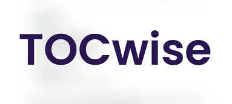
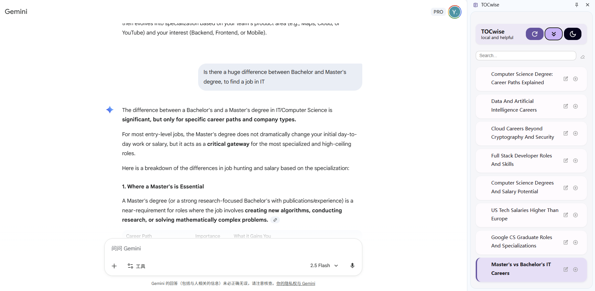
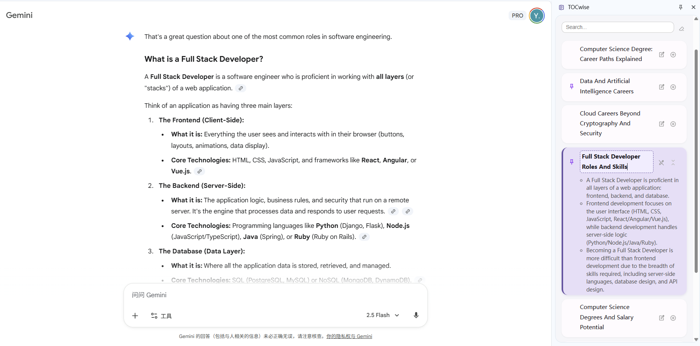
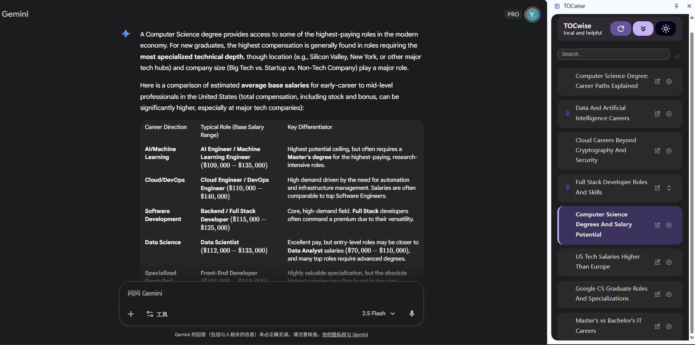

<p align="center">
  
</p>

<h1 align="center">TOCwise – AI-Powered Table of Contents</h1>


**TOCwise** is a Chrome extension built on **Gemini Nano AI**, primarily designed for **chatbot and AI conversation pages**, while also supporting long-form articles and documentation sites — making every page effortless to explore.  
It automatically understands the structure of any page, creates a **semantic, clickable table of contents**, and helps you jump instantly to the parts that matter.

---

## 🚀 Key Features

- **🤖 AI-Generated Semantic TOC** – Uses the built-in Gemini Nano AI to craft concise, meaningful titles for every section.
- **🎯 Adaptive Segmentation** – Works seamlessly on ChatGPT, Gemini, Claude, Qwen, and other long-form pages.  
- **📱 Integrated Sidebar** – Seamlessly anchored with Chrome’s Side Panel API for instant access.  
- **💾 Smart Multi-Tab Cache** – Keeps your outlines persistent while you switch between tabs.  
- **⚡ 100 % On-Device** – All AI processing runs locally for privacy and performance.  
- **🔗 Precise Anchor Navigation** – Smoothly scrolls to the exact location with a single click.  
- **📝 Section Summaries** – Generate short summaries for individual sections on demand.  
- **✏️ Editable Titles** – Instantly refine any heading by hand; you’re always in control.  
- **📍 Pin Key Sections** – Keep your most important titles within reach.  
- **🔍 Keyword Search** – Find the topic you need in a long outline in seconds.  
- **🌙 Dark Mode** – Matches your system theme for comfortable reading.  
- **🎨 Google Material Design** – Clean, minimal, and human-centered interaction at every step.

---

## 🧠 How It Works  

### Architecture

```
background.js → content.js → llm.js / llm_prompt.js → sidebar.js
                        ↑
                   segment.js
```

* **background.js** – The service worker that controls extension behavior and opens the sidebar when the icon is clicked.
* **content.js** – Injected into webpages; segments visible text blocks, calls AI to generate titles, and links each section to an anchor.
* **segment.js** – Detects page type and applies adaptive segmentation logic to extract content chunks.
* **llm.js / llm_prompt.js** – Connect to Chrome’s local **Gemini Nano** APIs for title and summary generation, with graceful fallback.
* **sidebar.js** – Renders the AI-generated outline, handles search, editing, pinning, dark mode, and smooth jump-to-section navigation.

**Flow:**
When the sidebar opens → `content.js` segments the page → `llm.js` names each chunk → `sidebar.js` displays the outline and syncs scrolling — all processed **locally on-device** via Gemini Nano.

---

### Adaptive Segmentation  
TOCwise automatically selects the most effective segmentation strategy for each site:

- **ChatGPT Pages** (`segmentPage_chatgpt`) – Detects `article[data-turn='assistant']`; each AI reply becomes a section.  
- **Claude Pages** (`segmentPage_claude`) – Reads `div[data-is-streaming="false"]` to capture full responses.  
- **Gemini Pages** (`segmentPage_gemini`) – Targets `model-response` elements within `div.conversation-container`.  
- **Qwen Pages** (`segmentPage_qwen`) – Parses `.response-message-body--normal` elements.  
- **Structured Pages** (`segmentPage_heading`) – Uses HTML headings (h1–h6) for semantic grouping.  
- **Generic Fallback** (`segmentPage_generic`) – Applies heuristics based on content length and tag type.

### Core Technologies  
- **DOM Analysis** – Detects main content blocks and ignores navigation noise.  
- **Anchor Generation** – Assigns unique IDs to each segment for precise scrolling.  
- **AI Summarization** – Uses Chrome’s Summarizer API (Gemini Nano) to generate titles and short abstracts.  
- **Real-Time Sync** – Highlights the current section as you scroll.

---

## ⚙️ Installation and Usage

### Developer Mode Setup  

1. **Download the project**
   - Download ZIP and extract
   - Or with git clone:
   ```bash
   git clone https://github.com/yjcwang/TOCwise.git
   cd TOCwise
2. **Open Chrome Extensions**
   - Navigate to `chrome://extensions/`
   - Turn on Developer Mode (top-right corner)

3. **Load the Extension**
   - Click “Load unpacked”
   - Select the project folder
   - Confirm installation success

4. **Verify**
   - The TOCwise icon appears in the Chrome toolbar
   - Open any page to try it out
  
5. **Open the Sidebar**
   - Click the TOCwise icon in the toolbar

## 📜 License & Credits

**MIT License** - Open source and free to use

**Built for Google Chrome Hackathon 2025** - Built for Google Chrome Hackathon 2025

**Acknowledgments:**

- Icons by Google Fonts Material Icons
- Design inspired by Google Material Design Guidelines

---

## 🔍 Example

### Try it out!
#### Chatbots
- [ChatGPT](https://chat.openai.com)
- [Claude](https://claude.ai)
- [Gemini](https://gemini.google.com)
- [Qwen](https://qwen.ai)
#### Other Webpages
- [Linux man page](https://linux.die.net/man/1/intro)
- [React Docs](https://react.dev/learn)
- [Bair Blog](https://bair.berkeley.edu/blog/2025/04/08/plaid/)

### Screenshots
<p align="center">
  
  <br/>
  <em>AI-generated sidebar outline on Google Gemini page</em>
</p>

<p align="center">
  
  <br/>
  <em>Expandable AI Summary, inline editing, and pinning features</em>
</p>

<p align="center">
  
  <br/>
  <em>Dark mode</em>
</p>

> ⚙️ **Note:**  
> TOCwise is primarily optimized for **AI chatbot interfaces** (ChatGPT, Gemini, Claude, Qwen).  
> While it also works on most **HTML-structured webpages**, some custom sites or component-based apps  
> may have unconventional DOM layouts where segmentation may be less precise.

*TOCwise automatically builds an AI-generated outline in the sidebar, allowing instant navigation, editing, and summarization.*


